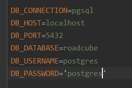
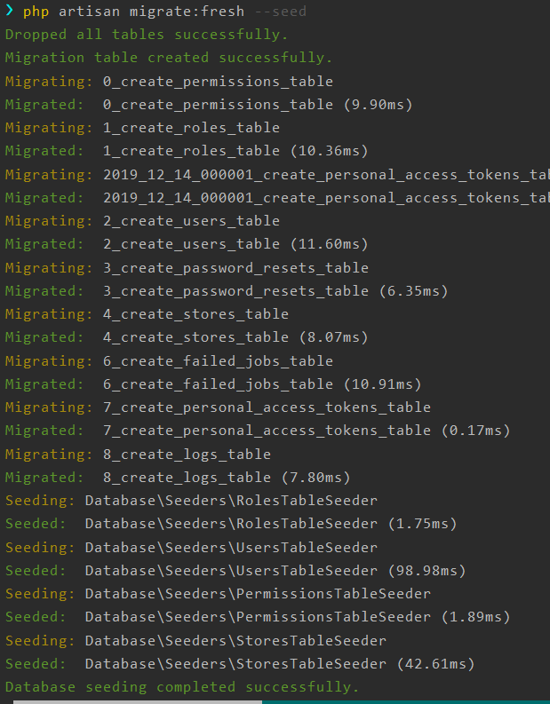

# RoadCube Store Api

Some instructions on how to use this Api created by Antonis Lilis

## Installation and test the Api

Be sure that you will follow the instructions below


## Download from zip or clone from Git

If you want to setup the project from the zip file you just have to extract this from roadCubeApi.zip
in a folder of your choice

In case you want to clone the project from Git [repository](https://github.com/antonislilis/roadcubeApi) just do the following
At first make sure that you have installed the git on your machine
```python
Create a folder of your choice
Inside the empty folder type

> git init
> git clone https://github.com/antonislilis/roadcubeApi.git
```
Now the project is on your folder. 
It's time to install dependencies. Make sure that you have installed the composer 

Type:
```python
> composer install
```
Now the vendor forder has been created
The project have been installed

## Create Database
This project is using PostgreSQL database schema

Make sure that you have the PostgreSQL installed.

Create a database in the postgreSQL named "roadcube" or a name of your choice ( You can define this later in the .env file)

## .env file
Inside the roadCubeApi.zip file there is a file named .env

Copy this file directly to the project root folder.

Now you can see something like:



Here you have to write your database name, password, host etc. In this .env file case, are some default values.

## Migrate and seed database
Once you finish with the database connection, is time to add the tables and some data in our database

To do this type:

```python
> php artisan migrate:fresh --seed
```

If everything goes as expected you will see something like



Great! The database is filled with tables and data.


## Testing the Api with Postman

